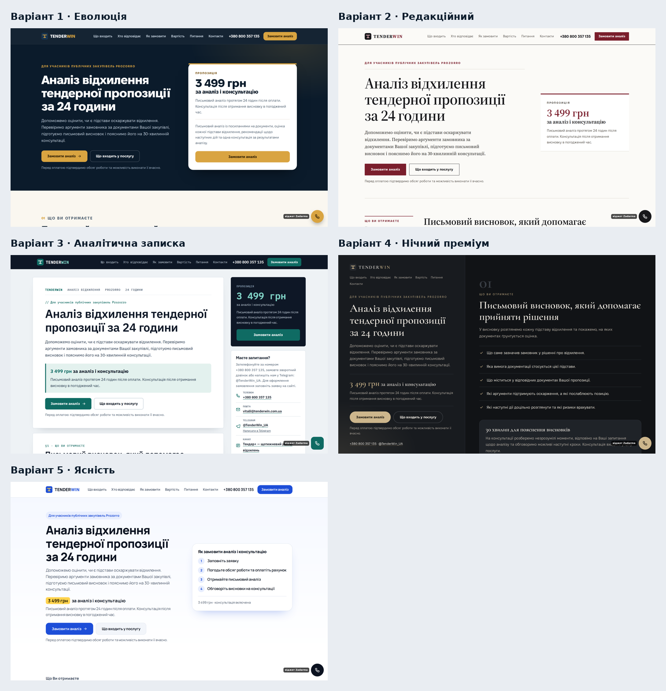

# П’ять варіантів дизайну TenderWin (етап 1, частина Г)

> **Вибір зроблено 02.10.2026:** варіант 1 «Еволюція», без блоку «Хто відповідає». Зібрано на сайті — див. [`docs/etap-2-zvit.md`](../docs/etap-2-zvit.md).
> Макети нижче лишаються як запис погодження.

Макети до розділу 20 інструкції v2.0. Віталій обирає один варіант (або один з елементами іншого) і фіксує вибір письмово:
номер варіанту, які елементи взяти з інших, зауваження. Після цього варіант збирається на етапі 2.

| № | Назва | Ідея одним рядком | Палітра | Шрифти |
|---|---|---|---|---|
| 1 | [Еволюція](variant-1/variant-1-notes.md) | Чинний бренд, більше повітря, картка «Пропозиція» в першому екрані | темно-синій, золото, теплий світлий | Fixel |
| 2 | [Редакційний](variant-2/variant-2-notes.md) | Сторінка як аналітична стаття юрфірми: антиква, поля з розділами, «бланк» ціни | папір, графіт, бордо | Source Serif 4 + Fixel |
| 3 | [Аналітична записка](variant-3/variant-3-notes.md) | Розділи-«аркуші» документа, виноски, закріплена панель із ціною | сіро-блакитний, білий, бірюза | IBM Plex Sans + Mono |
| 4 | [Нічний преміум](variant-4/variant-4-notes.md) | Темна бутикова подача, ліва панель із ціною завжди на екрані | графіт, шампань | Cormorant Garamond + Fixel |
| 5 | [Ясність](variant-5/variant-5-notes.md) | Максимально зрозумілий сервіс: великі елементи, шкала кроків, «Входить / Не входить» | білий, синій, жовтий акцент | Manrope |

Варіант 1 — рекомендована еволюція чинної палітри (для порівняння, розділ 20.2). Варіанти 2–5 від неї свідомо відходять.

## Як переглянути
- **Скриншоти:** у кожній папці `variant-N/` — уся сторінка (десктоп 1440 px і мобільний 390 px), перший екран, стани форми, розкрите FAQ.
- **Живі макети:** `variant-N/index.html` — адаптивні сторінки; відкрийте з локального сервера в корені репозиторію:
  `python3 -m http.server 8800` → `http://127.0.0.1:8800/design/variant-1/` (шрифти підтягуються з `site/fonts` і `design/fonts`).

## Як влаштовано
- `content.py` — **усі тексти** (розділ 6 дослівно) і спільні фрагменти розмітки. Тому тексти й блоки однакові в усіх варіантах (DV02).
- `build.py` — оформлення й компонування кожного варіанту → `variant-N/index.html`, `state-error.html`, `state-saved.html`.
- `shots.cjs` — скриншоти (Playwright). Перегенерувати: `python3 design/build.py && node design/shots.cjs 2`.
- `fonts/` — шрифти з ліцензією SIL OFL ([LICENSES.md](fonts/LICENSES.md)).

## Приймання (DV01–DV04)

| ID | Перевірка | Результат |
|---|---|---|
| DV01 | Комплектність: макет десктоп і мобільний, перший екран, стани форми й FAQ, обґрунтування, специфікація, відмінності | Є для всіх 5 (файли перелічено в кожному `variant-N-notes.md`). Повна сторінка десктопа — 1×, перший екран і мобільний — 2× |
| DV02 | Тексти розділу 6 і всі блоки розділу 5; одна головна дія | Тексти з одного джерела `content.py`; усі 9 блоків у кожному варіанті (блок «Останні розбори» — як текстове посилання на канал); головна дія «Замовити аналіз» → форма |
| DV03 | Перший екран: звичайним текстом 3 499 грн, 24 години, консультація, кнопка | Перевірено автоматично на 1440×900 і 390×844 для всіх 5 — так. На 320 px ціна видна після прокрутки, а нижня панель завжди має «Замовити аналіз» |
| DV04 | Контраст ключових пар ≥ 4,5:1 (межі полів ≥ 3:1), ліцензії шрифтів, походження зображень | Заміри — у кожному `notes`; найнижчий текстовий контраст 5,47:1. Шрифти — SIL OFL. Зображень і фото немає (місце для фото позначене), іконки — власні SVG |

Перевірено також: немає горизонтальної прокрутки на 320 px у жодному варіанті.

**Чого в макетах немає навмисно:** фото «команди», відгуків, логотипів клієнтів, нагород, таймерів, «100 % гарантій», відео й анімаційних бібліотек.
Справжнє фото Віталія і дозволений зразок висновку додаються, коли будуть (розділ 22).
