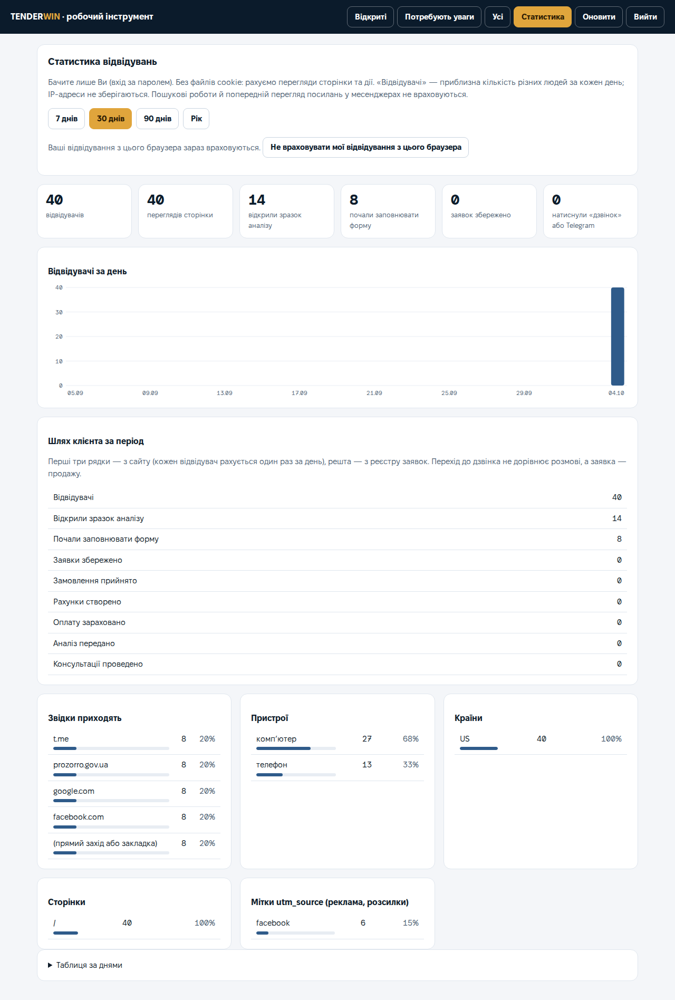

# Статистика відвідувань сайту

Статистику бачите лише Ви: **tenderwin.in.ua/admin/** → вхід паролем (секрет `ADMIN_TOKEN`) → кнопка **«Статистика»**.

## Що показує

- **Відвідувачі** — приблизна кількість різних людей за кожен день; **перегляди** — скільки разів відкрили сторінку.
- **Відкрили зразок аналізу**, **почали заповнювати форму**, **натиснули «дзвінок» або Telegram** — кожен відвідувач рахується один раз за день.
- **Шлях клієнта**: відвідувачі → зразок → форма → заявки → прийняті замовлення → рахунки → оплати → аналіз → консультації. Перші три кроки — із сайту, решта — з реєстру заявок.
- **Звідки приходять** (лише назва сайту: google.com, t.me, prozorro.gov.ua…), **пристрої**, **країни**, **сторінки**, **мітки utm_source**.
- Період: 7, 30, 90 днів або рік. Графік підказує цифри при наведенні; є таблиця за днями.

Щоб бачити, звідки приходять клієнти з реклами чи розсилки, додавайте до посилання мітку: `https://tenderwin.in.ua/?utm_source=facebook`.

## Свої відвідування

На вкладці «Статистика» натисніть **«Не враховувати мої відвідування з цього браузера»**. Позначка зберігається в цьому браузері; на телефоні й іншому комп’ютері натисніть її окремо.

## Як це влаштовано і що зберігається

- Сторінка надсилає обробнику `/api/hit` лише назву дії, адресу сторінки та сайт, з якого прийшов відвідувач. Файлів cookie немає, дані форми сюди не потрапляють.
- Для «унікальних відвідувачів» обробник рахує код із IP-адреси та браузера разом із випадковою «сіллю» поточного дня. IP-адреса не зберігається; коди й сіль видаляються не пізніше ніж за дві доби, тож відвідувача неможливо відстежити між днями.
- Зберігаються лише лічильники за днями (до 13 місяців).
- Пошукові роботи, перевірки доступності й попередній перегляд посилань у месенджерах не враховуються.
- Політику конфіденційності на сайті оновлено відповідно (розділ «Які дані обробляємо»).

Код: `worker/stats.js` (перевірка подій), `worker/index.js` (`hitStat`, `stats`, `/api/hit`, `/api/admin/stats`), `site/app.js` (надсилання подій), `site/admin/admin.js` (вкладка). Тести: `worker/tests/stats.test.js`, інтеграційні S01–S06.
